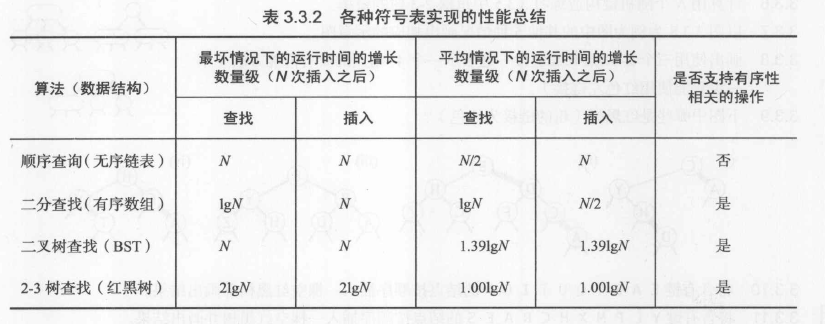

> 参见《算法第四版》

## 二叉查找树 (BST - Binary Search Tree)

二叉查找树是一颗二叉树，其中每个节点都含有一个 **Comparable** 的键以及相关联的值，且每个节点的键都大于其左子树中的任意节点的键，而小于其右子树中的任意节点的键。

1. 结点包含的链接可以指向空 (null) 或者其他节点
2. 每个结点只能有一个父节点指向自己 (根节点除外，它没有父节点)
3. 每个节点都只有两个链接，分别指向自己的**左子节点**和**右子节点**

### 2-3 查找树

一棵 **2-3 查找树**或为一棵空树，或由以下结点组成：

- 2 结点：含有一个键 (及其对应的值) 和两条链接，左链接指向的 2-3 树中的键都小于该节点，右链接指向的 2-3 树中的键都大于该结点
- 3 节点：含有两个键 (及其对应的值) 和三条链接，左链接指向的 2-3 树中的键都小于该节点，右链接指向的 2-3 树中的键都大于该节点

一颗**完美平衡**的 2-3 查找树中的所有空链接到根节点的距离都是相同的。

### 红黑二叉查找树 (红黑树)

使用标准的二叉查找树 (完全由 2 节点构成) 和一些其它的信息 (替换 3 结点) 来表示 2-3 树。

树中的链接分为两种类型：**红链接**与**黑链接**

使用左斜的**红链接**将两个 2 结点连接起来表示一个 3 结点，使用**黑链接**表示树中的普通链接。

红黑树具有如下性质：

- 红链接均为左连接
- 没有任何一个结点同时和两条红链接相连
- 该树是**完美黑色平衡**，即任意空链接到根结点的路径上的黑链接数量相同

#### 颜色转换

当一个结点有两个红色子结点时，除了将子结点的颜色由红变黑之外，还需要将父结点的颜色由黑变红。

> 结点的颜色指的是指向该结点的链接的颜色

插入操作：

- 如果右子结点是红色的而左子结点是黑色的，进行左旋转
- 如果左子结点是红色的且它的左子结点也是红色的，进行右旋转
- 如果左右子结点都是红色，进行颜色转换

各种查找算法的时间复杂度：

