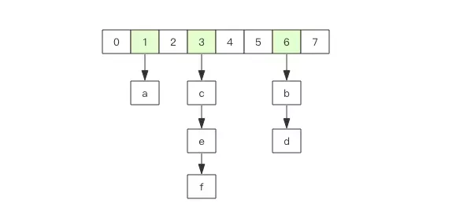

> 来自：[Redis 深度历险：核心原理与应用实践](https://juejin.im/book/5afc2e5f6fb9a07a9b362527/section)

## Redis 基础数据结构

Redis 有 5 种基础数据结构，分别为：string (字符串)、list (列表)、set (集合)、hash (哈希) 和 zset (有序集合)。

### string (字符串)

Redis 的字符串是动态字符串，是可以修改的字符串，内部结构实现上类似于 Java 的 ArrayList，采用预分配冗余空间的方式来减少内存的频繁分配。

内部为当前字符串实际分配的空间 capacity 一般要高于实际字符串长度 len。当字符串长度小于 1M 时，扩容都是加倍现有的空间，如果超过 1M，扩容时一次只会多扩 1M 的空间。需要注意的是字符串最大长度为 512M。

**键值对**
```bash
> set name codehole
OK
> get name
"codehole"
> exists name
(integer) 1
> del name
(integer) 1
> get name
(nil)
```

**批量键值对**

批量对多个字符串进行读写，节省网络耗时开销。

```bash
> set name1 codehole
OK
> set name2 holycoder
OK
> mget name1 name2 name3 # 返回一个列表
1) "codehole"
2) "holycoder"
3) (nil)
> mset name1 boy name2 girl name3 unknown
> mget name1 name2 name3
1) "boy"
2) "girl"
3) "unknown"
```

**过期和 set 命令扩展**

可以对 key 设置过期时间，到点自动删除，用来控制缓存的失效时间。

```bash
> set name codehole
> get name
"codehole"
> expire name 5  # 5s 后过期
...  # wait for 5s
> get name
(nil)

> setex name 5 codehole  # 5s 后过期，等价于 set+expire
> get name
"codehole"
... # wait for 5s
> get name
(nil)

> setnx name codehole  # 如果 name 不存在就执行 set 创建
(integer) 1
> get name
"codehole"
> setnx name holycoder
(integer) 0  # 因为 name 已经存在，所以 set 创建不成功
> get name
"codehole"  # 没有改变
```

**计数**

如果 value 值是一个整数，还可以对它进行自增操作。自增是有范围的，它的范围是 signed long 的最大最小值，超过了这个值，Redis 会报错。

```bash
> set age 30
OK
> incr age
(integer) 31
> incrby age 5
(integer) 36
> incrby age -5
(integer) 31
> set codehole 9223372036854775807  # Long.Max
OK
> incr codehole
(error) ERR increment or decrement would overflow
```

### list (列表)

Redis 的列表相当于 Java 语言里面的 LinkedList，它是链表而不是数组。这意味着 list 的插入和删除操作非常快，时间复杂度为 O(1)，但是索引定位很慢，时间复杂度为 O(n)。

当列表弹出了最后一个元素之后，该数据结构自动被删除，内存被回收。

**右边进左边出：队列**

```bash
> rpush books python java golang
(integer) 3
> llen books
(integer) 3
> lpop books
"python"
> lpop books
"java"
> lpop books
"golang"
> lpop books
(nil)
```

**右边进右边出：栈**

```bash
> rpush books python java golang
(integer) 3
> rpop books
"golang"
> rpop books
"java"
> rpop books
"python"
> rpop books
(nil)
```

**慢操作**

lindex 相当于 Java 链表的`get(int index)`方法，它需要对链表进行遍历，性能随着参数`index`增大而变差。

ltrim 的两个参数`start_index`和`end_index`定义了一个区间，在这个区间内的值，ltrim 要保留，区间之外统统砍掉。可以通过ltrim来实现一个定长的链表。

index 可以为负数，`index=-1`表示倒数第一个元素，同样`index=-2`表示倒数第二个元素。

```bash
> rpush books python java golang
(integer) 3
> lindex books 1  # O(n) 慎用
"java"
> lrange books 0 -1  # 获取所有元素，O(n) 慎用
1) "python"
2) "java"
3) "golang"
> ltrim books 1 -1 # O(n) 慎用
OK
> lrange books 0 -1
1) "java"
2) "golang"
> ltrim books 1 0 # 这其实是清空了整个列表，因为区间范围长度为负
OK
> llen books
(integer) 0
```

**快速列表**

 Redis 底层存储的不是一个简单的 `linkedlist`，而是称之为快速链表 `quicklist` 的一个结构。

在列表元素较少的情况下会使用一块连续的内存存储，这个结构是 `ziplist`，也即是压缩列表。它将所有的元素紧挨着一起存储，分配的是一块连续的内存。当数据量比较多的时候才会改成 `quicklist`

因为普通的链表需要的附加指针空间太大，会比较浪费空间，而且会加重内存的碎片化。

Redis 将链表和 `ziplist` 结合起来组成了 `quicklist`。也就是将多个 `ziplist` 使用双向指针串起来使用。这样既满足了快速的插入删除性能，又不会出现太大的空间冗余。

### hash (字典)

Redis 的字典相当于 Java 语言里面的 HashMap，它是无序字典。内部实现结构上同 Java 的 HashMap 也是一致的，同样的数组 + 链表二维结构。第一维 hash 的数组位置碰撞时，就会将碰撞的元素使用链表串接起来。

<div align="center"></div>
不同的是，Redis 的字典的值只能是字符串，另外它们 rehash 的方式不一样，因为 Java 的 HashMap 在字典很大时，rehash 是个耗时的操作，需要一次性全部 rehash。Redis 为了高性能，不能堵塞服务，所以采用了渐进式 rehash 策略。

渐进式 rehash 会在 rehash 的同时，保留新旧两个 hash 结构，查询时会同时查询两个 hash 结构，然后在后续的定时任务中以及 hash 操作指令中，循序渐进地将旧 hash 的内容一点点迁移到新的 hash 结构中。当搬迁完成了，就会使用新的hash结构取而代之。

当 hash 移除了最后一个元素之后，该数据结构自动被删除，内存被回收。

```bash
> hset books java "think in java"  # 命令行的字符串如果包含空格，要用引号括起来
(integer) 1
> hset books golang "concurrency in go"
(integer) 1
> hset books python "python cookbook"
(integer) 1
> hgetall books  # entries()，key 和 value 间隔出现
1) "java"
2) "think in java"
3) "golang"
4) "concurrency in go"
5) "python"
6) "python cookbook"
> hlen books
(integer) 3
> hget books java
"think in java"
> hset books golang "learning go programming"  # 因为是更新操作，所以返回 0
(integer) 0
> hget books golang
"learning go programming"
> hmset books java "effective java" python "learning python" golang "modern golang programming"  # 批量 set
OK
```

同字符串对象一样，hash 结构中的单个子 key 也可以进行计数，它对应的指令是 `hincrby`，和 `incr`使用基本一样。

```bash
> hincrby user age 5
(integer) 6
```

### set (集合)

Redis 的集合相当于 Java 语言里面的 HashSet，它内部的键值对是无序且唯一的。它的内部实现相当于一个特殊的字典，字典中所有的 value 都是一个值`NULL`。

当集合中最后一个元素移除之后，数据结构自动删除，内存被回收。

> set 结构可以用来存储活动中奖的用户 ID，因为有去重功能，可以保证同一个用户不会中奖两次。

```bash
> sadd books python
(integer) 1
> sadd books python  #  重复
(integer) 0
> sadd books java golang
(integer) 2
> smembers books  # 注意顺序，和插入的并不一致，因为 set 是无序的
1) "java"
2) "python"
3) "golang"
> sismember books java  # 查询某个 value 是否存在，相当于 contains(o)
(integer) 1
> sismember books rust
(integer) 0
> scard books  # 获取长度相当于 count()
(integer) 3
> spop books  # 弹出一个
"java"
```

### zset (有序集合)

zset 类似于 Java 的 SortedSet 和 HashMap 的结合体，一方面它是一个 set，保证了内部 value 的唯一性，另一方面它可以给每个 value 赋予一个 score，代表这个 value 的排序权重。它的内部实现用的是一种叫做「跳跃列表」的数据结构。

zset 中最后一个 value 被移除后，数据结构自动删除，内存被回收。

> 1. 可以用来存粉丝列表，value 值是粉丝的用户 ID，score 是关注时间。我们可以对粉丝列表按关注时间进行排序。
> 2. 可以用来存储学生的成绩，value 值是学生的 ID，score 是他的考试成绩。我们可以对成绩按分数进行排序就可以得到他的名次。

```bash
> zadd books 9.0 "think in java"
(integer) 1
> zadd books 8.9 "java concurrency"
(integer) 1
> zadd books 8.6 "java cookbook"
(integer) 1
> zrange books 0 -1  # 按 score 排序列出，参数区间为排名范围
1) "java cookbook"
2) "java concurrency"
3) "think in java"
> zrevrange books 0 -1  # 按 score 逆序列出，参数区间为排名范围
1) "think in java"
2) "java concurrency"
3) "java cookbook"
> zcard books  # 相当于 count()
(integer) 3
> zscore books "java concurrency"  # 获取指定 value 的 score
"8.9000000000000004"  # 内部 score 使用 double 类型进行存储，所以存在小数点精度问题
> zrank books "java concurrency"  # 排名
(integer) 1
> zrangebyscore books 0 8.91  # 根据分值区间遍历 zset
1) "java cookbook"
2) "java concurrency"
> zrangebyscore books -inf 8.91 withscores # 根据分值区间 (-∞, 8.91] 遍历 zset，同时返回分值。inf 代表 infinite，无穷大的意思。
1) "java cookbook"
2) "8.5999999999999996"
3) "java concurrency"
4) "8.9000000000000004"
> zrem books "java concurrency"  # 删除 value
(integer) 1
> zrange books 0 -1
1) "java cookbook"
2) "think in java"
```

### 容器型数据结构的通用规则

1. 如果容器不存在，那就创建一个，再进行操作。
2. 如果容器里元素没有了，那么立即删除元素，释放内存。

### 过期时间

Redis 所有的数据结构都可以设置过期时间，时间到了，Redis 会自动删除相应的对象。需要注意的是过期是以对象为单位。

> 比如一个 hash 结构的过期是整个 hash 对象的过期，而不是其中的某个子 key

**注意**：如果一个字符串已经设置了过期时间，然后你调用了 set 方法修改了它，它的过期时间会消失。

## 应用 1：分布式锁

分布式锁一般使用 setnx（set if not exists）指令，只允许被一个客户端占坑。先来先占， 用完了，再调用 del 指令进行释放。

```bash
// 这里的冒号:就是一个普通的字符，没特别含义，它可以是任意其它字符，不要误解
> setnx lock:codehole true
OK
... do something
> del lock:codehole
(integer) 1
```

但是有个问题，如果逻辑执行到中间出现异常了，可能会导致 del 指令没有被调用，这样就会陷入死锁，锁永远得不到释放。

可以在拿到锁之后，再给锁加上一个过期时间，比如 5s，这样即使中间出现异常也可以保证 5 秒之后锁会自动释放。

```bash
> setnx lock:codehole true
OK
> expire lock:codehole 5
... do something
> del lock:codehole
(integer) 1
```

但是还有问题，如果在 setnx 和 expire 之间服务器进程突然挂掉了，可能是因为机器掉电或者是被人为杀掉的，就会导致 expire 得不到执行，也会造成死锁。

这是因为 setnx 和 expire 是两条指令而不是原子指令。而且 expire 是依赖于 setnx 的执行结果的，如果 setnx 没抢到锁，expire 是不应该执行的。如果这两条指令可以一起执行就不会出现问题。

在 Redis 2.8 版本中作者加入了 set 指令的扩展参数，使得 setnx 和 expire 指令可以一起执行。

```bash
# ex seconds 将键的过期时间设置为seconds秒
# nx 只在键不存在时， 才对键进行设置操作
> set lock:codehole true ex 5 nx
OK
... do something
> del lock:codehole
```

还有一个方案是为 set 指令的 value 参数设置为一个随机数，释放锁时先匹配随机数是否一致，然后再删除 key，这是为了确保当前线程占有的锁不会被其它线程释放，除非这个锁是过期了被服务器自动释放的。 但是匹配 value 和删除 key 不是一个原子操作，这就需要使用 Lua 脚本来处理了，因为 Lua 脚本可以保证连续多个指令的原子性执行。

但是如果在加锁和释放锁之间的逻辑执行的太长，以至于超出了锁的超时限制，就会出现问题。因为这时候第一个线程持有的锁过期了，业务逻辑还没有执行完，这个时候第二个线程就提前重新持有了这把锁，导致代码不能得到严格的串行执行。

为了避免这个问题，Redis 分布式锁不要用于较长时间的任务。

## 应用 2：延时队列

### 异步消息队列

Redis 的 list(列表) 数据结构常用来作为异步消息队列使用，使用`rpush/lpush`操作入队列，使用`lpop/rpop`来出队列。

```bash
> rpush notify-queue apple banana pear
(integer) 3
> llen notify-queue
(integer) 3
> lpop notify-queue
"apple"
> llen notify-queue
(integer) 2
> lpop notify-queue
"banana"
> llen notify-queue
(integer) 1
> lpop notify-queue
"pear"
> llen notify-queue
(integer) 0
> lpop notify-queue
(nil)
```

客户端是通过队列的 pop 操作来获取消息，然后进行处理。处理完了再接着获取消息，再进行处理。

可是如果队列空了，客户端就会陷入 pop 的死循环，这就是空轮询。空轮询不但拉高了客户端的 CPU，redis 的 QPS 也会被拉高。

可以通过睡眠的办法来解决这个问题。

更好的解决办法是通过使用`blpop/brpop`。

阻塞队列没有数据的时候，会立即进入休眠状态，一旦数据到来，则立刻醒过来。消息的延迟几乎为零。

但是有个问题是，如果线程一直阻塞在哪里，Redis 的客户端连接就成了闲置连接，闲置过久，服务器一般会主动断开连接，减少闲置资源占用。这时blpop/brpop`就会抛出异常。所以客户端需要捕获异常，并且重试。

## 应用 3：位图

位图不是特殊的数据结构，它的内容其实就是普通的字符串，也就是 byte 数组。我们可以使用普通的 get/set 直接获取和设置整个位图的内容，也可以使用位图操作 getbit/setbit 等将 byte 数组看成「位数组」来处理。

```bash
# 字符串h对应的二进制为：01101000
127.0.0.1:6379> setbit s 1 1
(integer) 0
127.0.0.1:6379> setbit s 2 1
(integer) 0
127.0.0.1:6379> setbit s 4 1
(integer) 0
# 字符串e对应的二进制为：01100101
127.0.0.1:6379> setbit s 9 1
(integer) 0
127.0.0.1:6379> setbit s 10 1
(integer) 0
127.0.0.1:6379> setbit s 13 1
(integer) 0
127.0.0.1:6379> setbit s 15 1
(integer) 0
127.0.0.1:6379> get s
"he"
```

> **注意**：位数组的顺序和字符的位顺序是相反的

**零存零取**

就是是使用 setbit 对位值进行逐个设置，逐个读取。

```bash
127.0.0.1:6379> setbit w 1 1
(integer) 0
127.0.0.1:6379> setbit w 2 1
(integer) 0
127.0.0.1:6379> setbit w 4 1
(integer) 0
127.0.0.1:6379> getbit w 1  # 获取某个具体位置的值
(integer) 1
127.0.0.1:6379> getbit w 2
(integer) 1
127.0.0.1:6379> getbit w 4
(integer) 1
127.0.0.1:6379> getbit w 5
(integer) 0
```

**整存零取**

就是使用字符串一次性填充所有位数组，覆盖掉旧值。

```bash
127.0.0.1:6379> set w h  # 整存
(integer) 0
127.0.0.1:6379> getbit w 1
(integer) 1
127.0.0.1:6379> getbit w 2
(integer) 1
127.0.0.1:6379> getbit w 4
(integer) 1
127.0.0.1:6379> getbit w 5
(integer) 0
```

如果对应位的字节是不可打印字符，Redis 会显示该字符的 16 进制形式。

```bash
127.0.0.1:6379> setbit x 0 1
(integer) 0
127.0.0.1:6379> setbit x 1 1
(integer) 0
127.0.0.1:6379> get x
"\xc0"
```

**统计和查找**

Redis 提供了位图统计指令 bitcount 和位图查找指令 bitpos。bitcount 用来统计指定位置范围内 1 的个数，bitpos 用来查找指定范围内出现的第一个 0 或 1。并且都可以指定范围参数`[start, end]`。

> start、end表示的是第几个字节，并不能任意指定哪个位的位置。从0开始计数
>
> bitpos返回的是第几个位的位置，从0开始计数

```bash
# 01101000 01100101 01101100 01101100 01101111
127.0.0.1:6379> set w hello
OK
127.0.0.1:6379> bitcount w
(integer) 21
127.0.0.1:6379> bitcount w 0 0  # 第一个字符中 1 的位数
(integer) 3
127.0.0.1:6379> bitcount w 0 1  # 前两个字符中 1 的位数
(integer) 7
127.0.0.1:6379> bitpos w 0  # 第一个字节中0的位置
(integer) 0
127.0.0.1:6379> bitpos w 1  # 第一个字节中1的位置
(integer) 1
127.0.0.1:6379> bitpos w 1 1 1  # 第二个字符中，第一个1的位置
(integer) 9
127.0.0.1:6379> bitpos w 1 2 2  # 第三个字符中，第一个1的位置
(integer) 17
```

