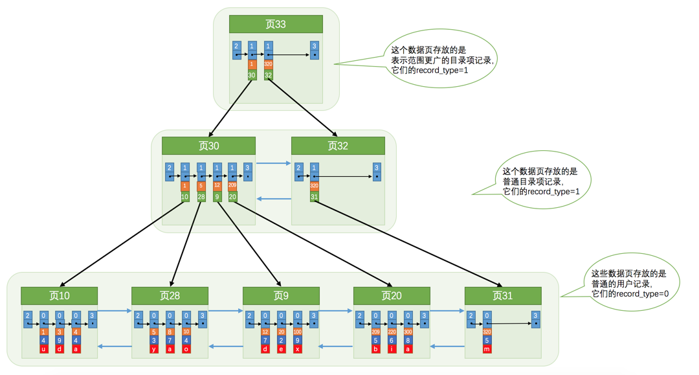
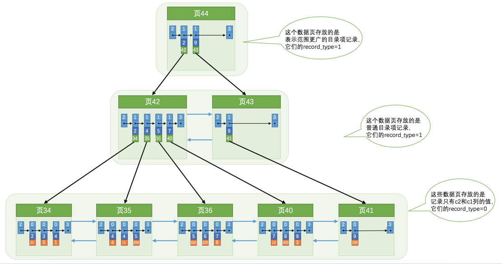

> 来源：[B+树索引](<https://juejin.im/book/5bffcbc9f265da614b11b731/section/5bffdb7c6fb9a049cd53ea84>)

每个索引都对应一棵 `B+` 树，`B+` 树分为好多层，最下边一层是叶子节点，其余的是内节点。所有 `用户记录` 都存储在 `B+` 树的叶子节点，所有 `目录项记录` 都存储在内节点。示意图如下 : 

##### 聚簇索引

- 使用记录主键值的大小进行记录和页的排序
  - 页内的记录是按照主键的大小顺序排成一个单向链表
  - 各个存放用户记录的页也是根据页中用户记录的主键大小顺序排成一个双向链表
  - 存放目录项记录的页分为不同的层次，在同一层次中的页也是根据页中目录项记录的主键大小顺序排成一个双向链表
- `B+` 树的叶子节点存储的是完整的用户记录
  - 所谓完整的用户记录，就是指这个记录中存储了所有列的值 (包括隐藏列)

我们把具有这两种特性的 `B+` 树称为`聚簇索引`，所有完整的用户记录都存放在这个`聚簇索引`的叶子节点处。这种`聚簇索引`并不需要我们在 MySQL 语句中显式的使用 `INDEX` 语句去创建，InnoDB 存储引擎会自动为我们创建聚簇索引。
在 InnoDB 存储引擎中，`聚簇索引`就是数据的存储方式 (所有的用户记录都存储在了`叶子节点`)，也就是所谓的索引即数据，数据即索引。

##### 二级索引

`聚簇索引`只能在搜索条件是主键值时才能发挥作用，因为 B+ 树中的数据都是按照主键进行排序的。如果想以别的列作为搜索条件，可以再建一棵 B+ 树。

> 使用 `c2` 列建立一棵 B+ 树的示例如下 ( `c1` 为主键列) : 

这颗 B+ 树的特点如下 : 

- 使用记录 `c2` 列的大小进行记录和页的排序，这包括三个方面的含义：
  - 页内的记录是按照 `c2` 列的大小顺序排成一个单向链表
  - 各个存放用户记录的页也是根据页中记录的 `c2` 列大小顺序排成一个双向链表
  - 存放目录项记录的页分为不同的层次，在同一层次中的页也是根据页中目录项记录的 `c2` 列大小顺序排成一个双向链表
- B+ 树的叶子节点存储的并不是完整的用户记录，而只是 `c2 列 + 主键` 这两个列的值
- 目录项记录中不再是`主键 + 页号`的搭配，而变成了 `c2 列 + 页号`的搭配。

但是这个 B+ 树的叶子节点中的记录只存储了 `c2` 和 `c1` (也就是`主键`) 两个列，所以我们必须再根据主键值去聚簇索引中再查找一遍完整的用户记录。这个过程被称之为`回表`。
也就是根据 `c2` 列的值查询一条完整的用户记录需要使用到 `2` 棵 B+ 树。

##### 联合索引

也可以同时以多个列的大小作为排序规则，也就是同时为多个列建立索引。

我们可以为自己感兴趣的列建立`二级索引`，`二级索引`的叶子节点包含的用户记录由`索引列 + 主键`组成，所以如果想通过`二级索引`来查找完整的用户记录的话，需要通过`回表`操作，也就是在通过`二级索引`找到主键值之后再到`聚簇索引`中查找完整的用户记录。

- `B+` 树中每层节点都是按照索引列值从小到大的顺序排序而组成了双向链表，而且每个页内的记录（不论是用户记录还是目录项记录）都是按照索引列的值从小到大的顺序而形成了一个单链表。如果是`联合索引`的话，则页面和记录先按照`联合索引`前边的列排序，如果该列值相同，再按照`联合索引`后边的列排序。
- 通过索引查找记录是从 `B+` 树的根节点开始，一层一层向下搜索。由于每个页面都按照索引列的值建立了 `Page Directory`（页目录），所以在这些页面中的查找非常快。

