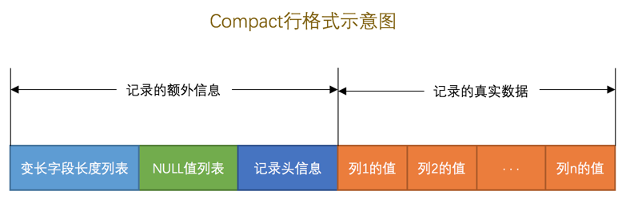
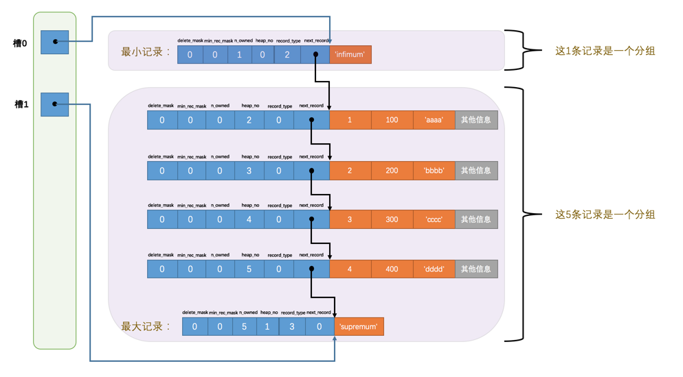

##### 02 初识MySQL

- 查看当前服务器程序支持的存储引擎

  `show engines;`

- 创建表时指定存储引擎

  ```mysql
  CREATE TABLE 表名(
      建表语句;
  ) ENGINE = 存储引擎名称;
  ```

- 修改表的存储引擎

  ```mysql
  ALTER TABLE 表名 ENGINE = 存储引擎名称;
  ```

---

##### 03 启动选项和配置文件

- 类Unix操作系统中的配置文件

  <div align="center">
    
  </div>

  

- 查看系统变量的命令

  `show variables [like 匹配的模式];`

  例：`show variables like 'max_connections';`

---

##### 04 字符集和比较规则

- `ASCII`字符集

  共收录128个字符，包括空格、标点符号、数字、大小写字母和一些不可见字符。

  由于总共才128个字符，所以可以使用1个字节来进行编码

- `ISO 8859-1`字符集

  共收录256个字符，是在`ASCII`字符集的基础上又扩充了128个西欧常用字符(包括德法两国的字母)，也可以使用1个字节来进行编码。

  它的别名叫`latin1`

- `GB2312`字符集

  收录了汉字以及拉丁字母、希腊字母、日文平假名及片假名字母、俄语西里尔字母。

  其中收录汉字6763个，其他文字符号682个。

  同时这种字符集又兼容`ASCII`字符集，所以在编码方式上显得有些奇怪：

  - 如果该字符在`ASCII`字符集中，则采用1字节编码。
  - 否则采用2字节编码。

- `GBK`字符集

  `GBK`字符集只是在收录字符范围上对`GB2312`字符集作了扩充，编码方式上兼容`GB2312`。

- `utf8`字符集

  收录所有的字符，而且还在不断扩充。

  这种字符集兼容`ASCII`字符集，采用变长编码方式，编码一个字符需要使用1～4个字节。

  > utf8只是Unicode字符集的一种编码方案，Unicode字符集可以采用utf8、utf16、utf32这几种编码方案，utf8使用1～4个字节编码一个字符，utf16使用2个或4个字节编码一个字符，utf32使用4个字节编码一个字符。

- MySQL中的`utf8`和`utf8mb4`

  - `utf8mb3`：阉割过的`utf8`字符集，只使用1～3个字节表示字符。

    我们常用的字符使用1～3个字节就可以表示了

  - `utf8mb4`：正宗的`utf8`字符集，使用1～4个字节表示字符

  在`MySQL`中`utf8`是`utf8mb3`的别名。

- 查看字符集的命令

  `show (character set | charset) [like 匹配的模式];`

  > `CHARACTER SET`和`CHARSET`是同义词，用任意一个都可以

- 查看比较规则的命令

  `show collation [like 匹配的模式]`

- 比较规则的规律

  - 比较规则名称以与其关联的字符集的名称开头

  - 后边紧跟着该比较规则主要作用于哪种语言

    比如：`utf8_polish_ci`表示以波兰语的规则比较

    `utf8_general_ci`是一种通用的比较规则

  - 名称后缀意味着该比较规则是否区分语言中的重音、大小写等

    |  后缀  |       英文释义       |       描述       |
    | :----: | :------------------: | :--------------: |
    | `_ai`  | `accent insensitive` |    不区分重音    |
    | `_as`  |  `accent sensitive`  |     区分重音     |
    | `_ci`  |  `case insensitive`  |   不区分大小写   |
    | `_cs`  |   `case sensitive`   |    区分大小写    |
    | `_bin` |       `binary`       | 以二进制方式比较 |

- 4个级别的字符集和比较规则分别是

  - 服务器级别
  - 数据库级别
  - 表级别
  - 列级别

- 服务器级别的字符集和比较规则的系统变量分别是

  - `character_set_server` - 服务器级别的字符集
  - `collation_server` - 服务器级别的比较规则

- 创建数据库时指定数据库的字符集和比较规则

  `create database 数据库名 character set 字符集名称 collate 比较规则名称;`

- 修改数据库字符集和比较规则

  `alter database 数据库名 character set 字符集名称 collate 比较规则名称;`

- 当前数据库使用的字符集和比较规则的系统变量分别是

  - `character_set_database` - 当前数据库的字符集
  - `collation_database` - 当前数据库的比较规则

  >  ***character_set_database*** 和 ***collation_database*** 这两个系统变量是只读的，不能通过修改这两个变量的值而改变当前数据库的字符集和比较规则。

- 创建表时指定字符集和比较规则

  ```mysql
  CREATE TABLE 表名 (列的信息)
      [CHARACTER SET 字符集名称]
      [COLLATE 比较规则名称]
  ```

- 修改表的字符集和比较规则

  ```mysql
  ALTER TABLE 表名
      [CHARACTER SET 字符集名称]
      [COLLATE 比较规则名称]
  ```

- 创建表的时候指定列的字符集和比较规则

  ```mysql
  CREATE TABLE 表名(
      列名 字符串类型 [CHARACTER SET 字符集名称] [COLLATE 比较规则名称],
      其他列...
  );
  ```

- 修改列的时候指定列的字符集和比较规则

  ```mysql
  ALTER TABLE 表名 MODIFY 列名 字符串类型 [CHARACTER SET 字符集名称] [COLLATE 比较规则名称];
  ```

- 仅修改字符集或仅修改比较规则时的变化规则

  - 只修改字符集，则比较规则将变为修改后的字符集默认的比较规则

  - 只修改比较规则，则字符集将变为修改后的比较规则对应的字符集

- 客户端与服务端通信时字符集的转换

  |          系统变量          |                             描述                             |
  | :------------------------: | :----------------------------------------------------------: |
  |   `character_set_client`   |                 服务器解码请求时使用的字符集                 |
  | `character_set_connection` | 服务器处理请求时会把请求字符串从`character_set_client`转为`character_set_connection` |
  |  `character_set_results`   |             服务器向客户端返回数据时使用的字符集             |

  客户端一般情况下使用的字符集与操作系统一致。

  通过`set names 字符集名`语句可以将这三个系统变量的值设置成和客户端一样。

---

##### 05 InnoDB记录存储结构

- 什么是InnoDB页

  InnoDB将数据划分为若干个页，以页作为磁盘和内存之间交互的基本单位，InnoDB中页的大小一般为 ***16*** KB。也就是说从磁盘中读取16KB的内容到内存中，一次最少把内存中的16KB内容刷新到磁盘中。

- InnoDB行格式的类型

  - Compact

  - Redundant

    `MySQL5.0`之前用的一种行格式

  - Dynamic

  - Compressed

- 怎么指定行格式

  - 创建表时指定

    ```mysql
    CREATE TABLE 表名 (
      列的信息
    ) ROW_FORMAT=行格式名称
    ```

  - 修改表时指定

    ```mysql
    ALTER TABLE 表名 ROW_FORMAT=行格式名称
    ```

- COMPACT行格式

  <div align="center">
    

- Dynamic/Compressed行格式

  - Dynamic行格式Compact行格式相似，只不过在处理`行溢出`数据时不会在记录的真实数据处存储字段真实数据的前`768`个字节，而是把所有的字节都存储到其他页面中，只在记录的真实数据处存储其他页面的地址。

  <div align="center">
    

  - `Compressed`行格式和`Dynamic`不同的一点是，`Compressed`行格式会采用压缩算法对页面进行压缩，以节省空间。

- 行溢出

  如果某一列中的数据非常多的话，在本记录的真实数据处只会存储该列的前`768`个字节的数据和一个指向其他页的地址，然后把剩下的数据存放到其他页中，这个过程也叫做`行溢出`，存储超出`768`字节的那些页面也被称为`溢出页`。

  <div align="center">
    

##### 06 InnoDB索引页结构

- 什么是索引（INDEX）页

  专门用来存放表中记录的页

- 索引页的结构

  索引页`16KB`大小的存储空间可以被划分为多个部分，不同部分有不同的功能。

  <div align="center">
    
  </div>

- 索引页各个部分的含义

  | 名称                 | 中文名             | 占用空间大小 | 简单描述                 |
  | :------------------- | :----------------- | :----------- | :----------------------- |
  | `File Header`        | 文件头部           | `38`字节     | 页的一些通用信息         |
  | `Page Header`        | 页面头部           | `56`字节     | 数据页专有的一些信息     |
  | `Infimum + Supremum` | 最小记录和最大记录 | `26`字节     | 两个虚拟的行记录         |
  | `User Records`       | 用户记录           | 不确定       | 实际存储的行记录内容     |
  | `Free Space`         | 空闲空间           | 不确定       | 页中尚未使用的空间       |
  | `Page Directory`     | 页面目录           | 不确定       | 页中的某些记录的相对位置 |
  | `File Trailer`       | 文件尾部           | `8`字节      | 校验页是否完整           |

- 记录在页中的存储

  存储的记录会按照我们指定的`行格式`存储到`User Records`部分。

  但是在一开始生成页的时候，其实并没有`User Records`这个部分，每当我们插入一条记录，都会从`Free Space`部分，也就是尚未使用的存储空间中申请一条数据大小的空间划分到`User Records`部分，当`Free Space`部分的空间全部被`User Records`部分替代掉之后，也就意味着这个页使用完了，如果还有新的记录插入，需要去申请新的页。

  <div align="center">
    
  </div>

- 记录头信息的结构

  <div align="center">
    
  </div>

- 记录头信息各个部分的含义

  | 名称           | 大小（单位：bit） | 描述                                                         |
  | :------------- | :---------------: | :----------------------------------------------------------- |
  | `预留位1`      |        `1`        | 没有使用                                                     |
  | `预留位2`      |        `1`        | 没有使用                                                     |
  | `delete_mask`  |        `1`        | 标记该记录是否被删除                                         |
  | `min_rec_mask` |        `1`        | B+树的每层非叶子节点中的最小记录都会添加该标记               |
  | `n_owned`      |        `4`        | 表示当前记录拥有的记录数                                     |
  | `heap_no`      |       `13`        | 表示当前记录在本页的位置信息                                 |
  | `record_type`  |        `3`        | 表示当前记录的类型，`0`表示普通记录，`1`表示B+树非叶节点记录，`2`表示最小记录，`3`表示最大记录 |
  | `next_record`  |       `16`        | 表示下一条记录的相对位置                                     |

- 什么是伪记录或者虚拟记录

  InnoDB在每个页加了两条记录，一条代表最小记录，一条代表最大记录。

  这两条记录单独放在一个称为`Infimum + Supremum`的部分。

  <div align="center">
    
  </div>

  规定：最小记录的下一条记录就是本页中主键值最小的用户记录，而本页中主键值最大的用户记录的下一条记录就是最大记录。

- User Records中数据的存储结构

  <div align="center">
    
  </div>

  InnoDB始终会维护一条记录的单链表，链表中的各个节点是按照主键值由小到大的顺序通过`next_record`连接起来的。

  当索引页中存在多条被删除掉的记录时，会通过`next_record`将这些被删除掉的记录组成一个垃圾链表，以备之后重用这部分存储空间。

- 页目录（Page Directory）的形成过程

  - 将所有正常的记录（包括最大和最小记录，不包括标记为已删除的记录）划分为几个组。

  - 每个组的最后一条记录（组内最大的那条记录）的头信息中的`n_owned`属性表示该组内共有几条记录。

  - 将每个组的最后一条记录的地址偏移量单独提取出来按顺序存储到`页目录`中。

    页目录中的这些地址偏移量被称为`槽`（Slot）

- 记录与页目录的逻辑关系

  <div align="center">
    
  </div>

- 页目录每个分组中记录条数的规定

  - 对于最小记录所在的分组只能有 ***1*** 条记录
  - 最大记录所在的分组拥有的记录条数只能在 ***1~8*** 条之间
  - 剩下的分组中记录的条数范围只能在是 ***4~8*** 条之间

  

