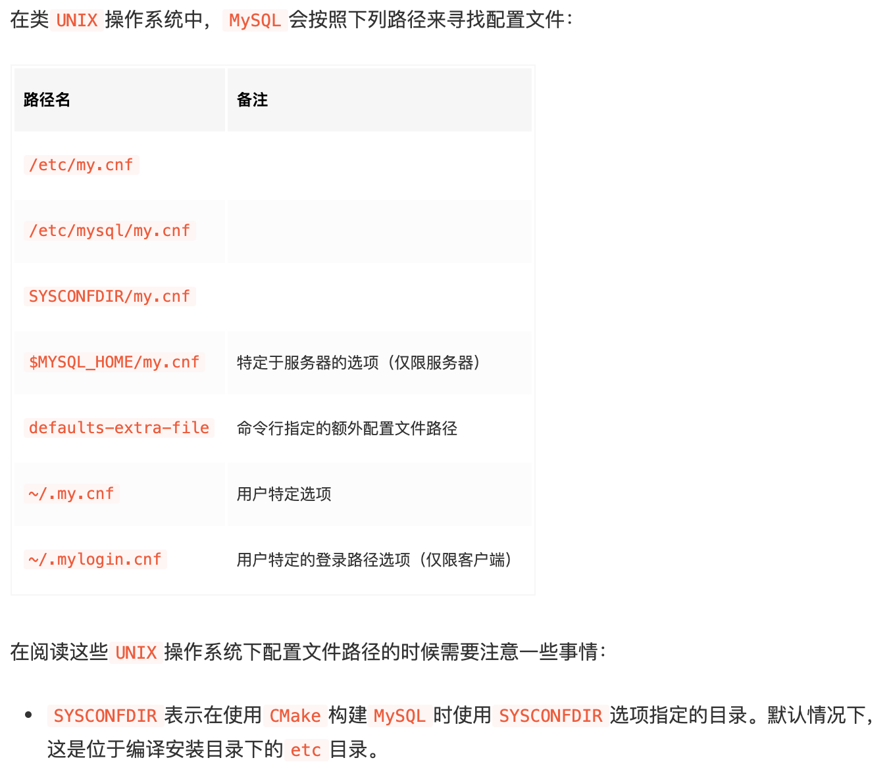
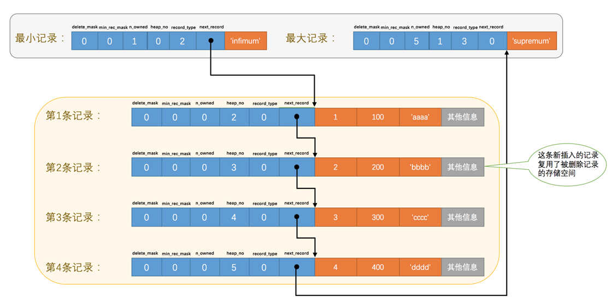
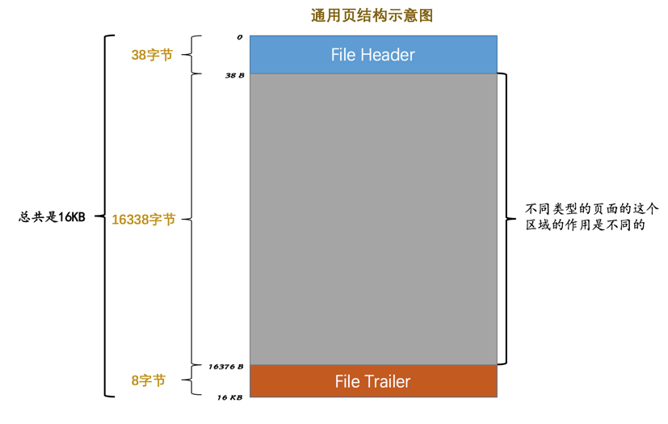

> 神作：[MySQL 是怎样运行的：从根儿上理解 MySQL](https://juejin.im/book/5bffcbc9f265da614b11b731)  

##### 02 初识MySQL

- 查看当前服务器程序支持的存储引擎

  `show engines;`

- 创建表时指定存储引擎

  ```mysql
  CREATE TABLE 表名(
      建表语句;
  ) ENGINE = 存储引擎名称;
  ```

- 修改表的存储引擎

  ```mysql
  ALTER TABLE 表名 ENGINE = 存储引擎名称;
  ```

---

##### 03 启动选项和配置文件

- 类Unix操作系统中的配置文件

  <div align="center">
    
  </div>

  

- 查看系统变量的命令

  `show variables [like 匹配的模式];`

  例：`show variables like 'max_connections';`

---

##### 04 字符集和比较规则

- `ASCII`字符集

  共收录128个字符，包括空格、标点符号、数字、大小写字母和一些不可见字符。

  由于总共才128个字符，所以可以使用1个字节来进行编码

- `ISO 8859-1`字符集

  共收录256个字符，是在`ASCII`字符集的基础上又扩充了128个西欧常用字符(包括德法两国的字母)，也可以使用1个字节来进行编码。

  它的别名叫`latin1`

- `GB2312`字符集

  收录了汉字以及拉丁字母、希腊字母、日文平假名及片假名字母、俄语西里尔字母。

  其中收录汉字6763个，其他文字符号682个。

  同时这种字符集又兼容`ASCII`字符集，所以在编码方式上显得有些奇怪：

  - 如果该字符在`ASCII`字符集中，则采用1字节编码。
  - 否则采用2字节编码。

- `GBK`字符集

  `GBK`字符集只是在收录字符范围上对`GB2312`字符集作了扩充，编码方式上兼容`GB2312`。

- `utf8`字符集

  收录所有的字符，而且还在不断扩充。

  这种字符集兼容`ASCII`字符集，采用变长编码方式，编码一个字符需要使用1～4个字节。

  > utf8只是Unicode字符集的一种编码方案，Unicode字符集可以采用utf8、utf16、utf32这几种编码方案，utf8使用1～4个字节编码一个字符，utf16使用2个或4个字节编码一个字符，utf32使用4个字节编码一个字符。

- MySQL中的`utf8`和`utf8mb4`

  - `utf8mb3`：阉割过的`utf8`字符集，只使用1～3个字节表示字符。

    我们常用的字符使用1～3个字节就可以表示了

  - `utf8mb4`：正宗的`utf8`字符集，使用1～4个字节表示字符

  在`MySQL`中`utf8`是`utf8mb3`的别名。

- 查看字符集的命令

  `show (character set | charset) [like 匹配的模式];`

  > `CHARACTER SET`和`CHARSET`是同义词，用任意一个都可以

- 查看比较规则的命令

  `show collation [like 匹配的模式]`

- 比较规则的规律

  - 比较规则名称以与其关联的字符集的名称开头

  - 后边紧跟着该比较规则主要作用于哪种语言

    比如：`utf8_polish_ci`表示以波兰语的规则比较

    `utf8_general_ci`是一种通用的比较规则

  - 名称后缀意味着该比较规则是否区分语言中的重音、大小写等

    |  后缀  |       英文释义       |       描述       |
    | :----: | :------------------: | :--------------: |
    | `_ai`  | `accent insensitive` |    不区分重音    |
    | `_as`  |  `accent sensitive`  |     区分重音     |
    | `_ci`  |  `case insensitive`  |   不区分大小写   |
    | `_cs`  |   `case sensitive`   |    区分大小写    |
    | `_bin` |       `binary`       | 以二进制方式比较 |

- 4个级别的字符集和比较规则分别是

  - 服务器级别
  - 数据库级别
  - 表级别
  - 列级别

- 服务器级别的字符集和比较规则的系统变量分别是

  - `character_set_server` - 服务器级别的字符集
  - `collation_server` - 服务器级别的比较规则

- 创建数据库时指定数据库的字符集和比较规则

  `create database 数据库名 character set 字符集名称 collate 比较规则名称;`

- 修改数据库字符集和比较规则

  `alter database 数据库名 character set 字符集名称 collate 比较规则名称;`

- 当前数据库使用的字符集和比较规则的系统变量分别是

  - `character_set_database` - 当前数据库的字符集
  - `collation_database` - 当前数据库的比较规则
  >  ***character_set_database*** 和 ***collation_database*** 这两个系统变量是只读的，不能通过修改这两个变量的值而改变当前数据库的字符集和比较规则。

- 创建表时指定字符集和比较规则

  ```mysql
  CREATE TABLE 表名 (列的信息)
      [CHARACTER SET 字符集名称]
      [COLLATE 比较规则名称]
  ```

- 修改表的字符集和比较规则

  ```mysql
  ALTER TABLE 表名
      [CHARACTER SET 字符集名称]
      [COLLATE 比较规则名称]
  ```

- 创建表的时候指定列的字符集和比较规则

  ```mysql
  CREATE TABLE 表名(
      列名 字符串类型 [CHARACTER SET 字符集名称] [COLLATE 比较规则名称],
      其他列...
  );
  ```

- 修改列的时候指定列的字符集和比较规则

  ```mysql
  ALTER TABLE 表名 MODIFY 列名 字符串类型 [CHARACTER SET 字符集名称] [COLLATE 比较规则名称];
  ```

- 仅修改字符集或仅修改比较规则时的变化规则

  - 只修改字符集，则比较规则将变为修改后的字符集默认的比较规则

  - 只修改比较规则，则字符集将变为修改后的比较规则对应的字符集

- 客户端与服务端通信时字符集的转换

  |          系统变量          |                             描述                             |
  | :------------------------: | :----------------------------------------------------------: |
  |   `character_set_client`   |                 服务器解码请求时使用的字符集                 |
  | `character_set_connection` | 服务器处理请求时会把请求字符串从`character_set_client`转为`character_set_connection` |
  |  `character_set_results`   |             服务器向客户端返回数据时使用的字符集             |

  客户端一般情况下使用的字符集与操作系统一致。

  通过`set names 字符集名`语句可以将这三个系统变量的值设置成和客户端一样。

---

##### 05 InnoDB记录存储结构

- 什么是InnoDB页

  InnoDB将数据划分为若干个页，以页作为磁盘和内存之间交互的基本单位，InnoDB中页的大小一般为 ***16*** KB。也就是说从磁盘中读取16KB的内容到内存中，一次最少把内存中的16KB内容刷新到磁盘中。

- InnoDB行格式的类型

  - Compact

  - Redundant

    `MySQL5.0`之前用的一种行格式

  - Dynamic

  - Compressed

- 怎么指定行格式

  - 创建表时指定

    ```mysql
    CREATE TABLE 表名 (
      列的信息
    ) ROW_FORMAT=行格式名称
    ```

  - 修改表时指定

    ```mysql
    ALTER TABLE 表名 ROW_FORMAT=行格式名称
    ```

- COMPACT行格式

  <div align="center">
    

- Dynamic/Compressed行格式

  - Dynamic行格式Compact行格式相似，只不过在处理`行溢出`数据时不会在记录的真实数据处存储字段真实数据的前`768`个字节，而是把所有的字节都存储到其他页面中，只在记录的真实数据处存储其他页面的地址。

  <div align="center">
    

  - `Compressed`行格式和`Dynamic`不同的一点是，`Compressed`行格式会采用压缩算法对页面进行压缩，以节省空间。

- 行溢出

  如果某一列中的数据非常多的话，在本记录的真实数据处只会存储该列的前`768`个字节的数据和一个指向其他页的地址，然后把剩下的数据存放到其他页中，这个过程也叫做`行溢出`，存储超出`768`字节的那些页面也被称为`溢出页`。

  <div align="center">
    

---

##### 06 InnoDB索引页结构

- 什么是索引（INDEX）页

  专门用来存放表中记录的页

- 索引页的结构

  索引页`16KB`大小的存储空间可以被划分为多个部分，不同部分有不同的功能。

  <div align="center">
    
  </div>

- 索引页各个部分的含义

  | 名称                 | 中文名             | 占用空间大小 | 简单描述                 |
  | :------------------- | :----------------- | :----------- | :----------------------- |
  | `File Header`        | 文件头部           | `38`字节     | 页的一些通用信息         |
  | `Page Header`        | 页面头部           | `56`字节     | 数据页专有的一些信息     |
  | `Infimum + Supremum` | 最小记录和最大记录 | `26`字节     | 两个虚拟的行记录         |
  | `User Records`       | 用户记录           | 不确定       | 实际存储的行记录内容     |
  | `Free Space`         | 空闲空间           | 不确定       | 页中尚未使用的空间       |
  | `Page Directory`     | 页面目录           | 不确定       | 页中的某些记录的相对位置 |
  | `File Trailer`       | 文件尾部           | `8`字节      | 校验页是否完整           |

- 记录在页中的存储

  存储的记录会按照我们指定的`行格式`存储到`User Records`部分。

  但是在一开始生成页的时候，其实并没有`User Records`这个部分，每当我们插入一条记录，都会从`Free Space`部分，也就是尚未使用的存储空间中申请一条数据大小的空间划分到`User Records`部分，当`Free Space`部分的空间全部被`User Records`部分替代掉之后，也就意味着这个页使用完了，如果还有新的记录插入，需要去申请新的页。

  <div align="center">
    
  </div>

- 记录头信息的结构

  <div align="center">
    
  </div>

- 记录头信息各个部分的含义

  | 名称           | 大小（单位：bit） | 描述                                                         |
  | :------------- | :---------------: | :----------------------------------------------------------- |
  | `预留位1`      |        `1`        | 没有使用                                                     |
  | `预留位2`      |        `1`        | 没有使用                                                     |
  | `delete_mask`  |        `1`        | 标记该记录是否被删除                                         |
  | `min_rec_mask` |        `1`        | B+树的每层非叶子节点中的最小记录都会添加该标记               |
  | `n_owned`      |        `4`        | 表示当前记录拥有的记录数                                     |
  | `heap_no`      |       `13`        | 表示当前记录在本页的位置信息                                 |
  | `record_type`  |        `3`        | 表示当前记录的类型：<br />`0`表示普通记录；<br />`1`表示B+树非叶节点记录（目录项）；<br />`2`表示最小记录；<br />`3`表示最大记录； |
  | `next_record`  |       `16`        | 表示下一条记录的相对位置                                     |

- 什么是伪记录或者虚拟记录

  InnoDB在每个页加了两条记录，一条代表最小记录，一条代表最大记录。

  这两条记录单独放在一个称为`Infimum + Supremum`的部分。

  <div align="center">
    
  </div>

  规定：最小记录的下一条记录就是本页中主键值最小的用户记录，而本页中主键值最大的用户记录的下一条记录就是最大记录。

- User Records中数据的存储结构

  <div align="center">
    
  </div>

  InnoDB始终会维护一条记录的单链表，链表中的各个节点是按照主键值由小到大的顺序通过`next_record`连接起来的。

  当索引页中存在多条被删除掉的记录时，会通过`next_record`将这些被删除掉的记录组成一个垃圾链表，以备之后重用这部分存储空间。

- 页目录（Page Directory）的形成过程

  - 将所有正常的记录（包括最大和最小记录，不包括标记为已删除的记录）划分为几个组。

  - 每个组的最后一条记录（组内最大的那条记录）的头信息中的`n_owned`属性表示该组内共有几条记录。

  - 将每个组的最后一条记录的地址偏移量单独提取出来按顺序存储到`页目录`中。

    页目录中的这些地址偏移量被称为`槽`（Slot）

- 记录与页目录的逻辑关系

  <div align="center">
    
  </div>

- 页目录每个分组中记录条数的规定

  - 对于最小记录所在的分组只能有 ***1*** 条记录
  - 最大记录所在的分组拥有的记录条数只能在 ***1~8*** 条之间
  - 剩下的分组中记录的条数范围只能在是 ***4~8*** 条之间

- 一个数据页中查找指定主键值的记录的过程为：

  - 通过二分法确定该记录所在的槽，并找到该槽所在分组中主键值最小的那条记录。
  - 通过记录的`next_record`属性遍历该槽所在的组中的各个记录。

- 什么是页面头部（Page Header）

  是`页`结构的第二部分，占用固定的`56`个字节，专门存储各种状态信息。

  比如本页中已经存储了多少条记录，第一条记录的地址是什么，页目录中存储了多少个槽等等。

- 什么是文件头部（File Header）

  存储各种页都通用的一些信息，占用固定的`38`个字节。

  比如这个页的编号，上一个页、下一个页是谁等等。

  `InnoDB`都是以页为单位存放数据的，如果数据占用的空间非常大，通过文件头部将这些数据页关联起来，所有的数据页其实是一个双链表：

  <div align="center">
    
  </div>

- 什么是文件尾部（File Trailer）

  为了检测一个页是否完整，由固定的`8`个字节组成。

  如果某页中的数据在内存中被修改了，那么在修改后的某个时间需要把数据同步到磁盘中。但是在同步了一半的时候中出问题了，所以需要对页是否完整进行校验。

  - 前4个字节代表页的校验和

    这个部分是和`File Header`中的校验和相对应的。每当一个页面在内存中修改了，在同步之前就要把它的校验和算出来，因为`File Header`在页面的前边，所以校验和会被首先同步到磁盘，当完全写完时，校验和也会被写到页的尾部，如果完全同步成功，则页的首部和尾部的校验和应该是一致的。

    如果出问题了，那么在`File Header`中的校验和就代表着已经修改过的页，而在`File Trailer`中的校验和代表着原先的页，二者不同则意味着同步中间出了错。

  - 后4个字节代表页面被最后修改时对应的日志序列位置（LSN）

---

##### 07 B+树索引

- 没有索引的列怎么查找

  从第一个页沿着双向链表一直往下找，在每一个页中从`最小记录`开始依次遍历单链表中的每条记录，然后对比每条记录是不是符合搜索条件。

- 建立索引的步骤

  - 下一个数据页中用户记录的主键值必须大于上一个页中用户记录的主键值

    在对页中的记录进行增删改操作的过程中，需要通过一些诸如移动记录的操作来始终保证这条规定一直成立，这个过程称之为`页分裂`

  - 给所有的页建一个目录项

    每个页对应一个目录项，每个目录项包括下边两个部分：

    - 页的用户记录中最小的主键值
    - 页号

  > 目录其实就是`索引`

  <div align="center">
    
  </div>

- 目录项纪录与用户纪录的区别
  - `目录项记录`的`record_type`值是1，而普通用户记录的`record_type`值是0
  - `目录项记录`只有主键值和页的编号两个列，而普通的用户记录的列是用户自己定义的，可能包含很多列，另外还有`InnoDB`自己添加的隐藏列
  - 只有存储`目录项记录`的页中，主键值最小的`目录项记录`的`min_rec_mask`值为`1`，其他别的记录的`min_rec_mask`值都是`0`

  <div align="center">
    
  </div>

- 根据主键值查找一条用户记录的步骤

  - 确定`目录项记录`页
  - 通过`目录项记录`页确定用户记录真实所在的页
  - 在真实存储用户记录的页中定位到具体的记录

- B+树的特点

  <div align="center">
    
  </div>

  <div align="center">
    
  </div>

  - 实际用户记录其实都存放在B+树的最底层的节点上，这些节点也被称为`叶子节点`或`叶节点`
  - 存放`目录项`的节点称为`非叶子节点`或者`内节点`
  - 最上面的节点称为`根节点`

- 聚族索引的特点

  - 使用记录主键值的大小进行记录和页的排序

    - 页内的记录是按照主键的大小顺序排成一个单向链表
    - 各个存放用户记录的页也是根据页中用户记录的主键大小顺序排成一个双向链表
    - 存放目录项记录的页分为不同的层次，在同一层次中的页也是根据页中目录项记录的主键大小顺序排成一个双向链表

  - `B+`树的叶子节点存储的是完整的用户记录。

    所谓完整的用户记录，就是指这个记录中存储了所有列的值（包括隐藏列）

  具有这两种特性的`B+`树称为`聚簇索引`。

  `InnoDB`存储引擎会自动的为我们创建聚簇索引。

  `聚簇索引`就是数据的存储方式（所有的用户记录都存储在了`叶子节点`），也就是所谓的索引即数据，数据即索引。

- 什么是二级索引

  按照`非主键列`建立的`B+`树需要一次`回表`操作才可以定位到完整的用户记录，这种B+树被称为`二级索引`（`secondary index`）或者`辅助索引`。

- 什么是`回表`操作

  按照`非主键列`大小排序的`B+`树只能确定要查找记录的主键值，如果想根据`非主键列`的值查找到完整的用户记录，需要到`聚簇索引`中再查一遍，这个过程被称之为`回表`。

- 二级索引有什么特点

  - 使用`索引列`的大小进行记录和页的排序，即：
    - 页内的记录是按照`索引列`大的小顺序排成一个单向链表
    - 各个存放用户记录的页也是根据页中记录的`索引列`大小顺序排成一个双向链表
    - 存放目录项记录的页分为不同的层次，在同一层次中的页也是根据页中目录项记录的`索引列`大小顺序排成一个双向链表
  - `B+`树的叶子节点存储的并不是完整的用户记录，而只是`索引列+主键`这两个列的值
  - 目录项记录中不再是`主键+页号`的搭配，而变成了`索引列+主键+页号`的搭配

- 什么是联合索引

  同时以多个列的大小作为排序规则，即为多个列建立索引。

  联合索引其实也是一个二级索引。

- B+树索引注意事项

  - 为某个表创建一个`B+`树索引（聚簇索引不是人为创建的，默认就有）的时候，都会为这个索引创建一个`根节点`页面。

    最开始表中没有数据的时候，每个`B+`树索引对应的`根节点`中既没有用户记录，也没有目录项记录

  - 向表中插入用户记录时，先把用户记录存储到这个`根节点`中

  - 当`根节点`中的可用空间用完时继续插入记录，此时会将`根节点`中的所有记录复制到一个新分配的页，比如`页a`中，然后对这个新页进行`页分裂`的操作，得到另一个新页，比如`页b`。

    这时新插入的记录根据键值（也就是聚簇索引中的主键值，二级索引中对应的索引列的值）的大小就会被分配到`页a`或者`页b`中，而`根节点`便升级为存储目录项记录的页。

  一个B+树索引的根节点被创建后，便不会再移动。它的页号会被记录到数据词典中，以后需要用到这个索引时，就直接从数据字典中取出对应的`页号`，以访问它的索引。

  - 为了保证B+树同一层内节点的目录项记录除`页号`字段以外是唯一的，所以二级索引内节点的目录项纪录的内容由三部分构成：
    - 索引列的值
    - 主键值
    - 页号
  - 一个页面最少存储两条记录

- MyISAM索引方案

  - 将表中的记录按照记录的插入顺序单独存储在一个文件中，称之为`数据文件`。这个文件并不划分为若干个数据页，有多少记录就往这个文件中塞多少记录。

    可以通过行号快速访问到一条记录。

    由于在插入数据的时候并没有按照主键大小排序，所以不能在这些数据上使用二分法进行查找

  - 使用`MyISAM`存储引擎的表会把索引信息另外存储到一个称为`索引文件`的文件中。

    `MyISAM`会单独为表的主键创建一个索引，只不过在索引的叶子节点中存储的不是完整的用户记录，而是`主键值 + 行号`的组合。也就是先通过索引找到对应的行号，再通过行号去找对应的记录

  - 我们也可以对其它的列分别建立索引或者建立联合索引，原理和`InnoDB`中的索引差不多，不过在叶子节点处存储的是`相应的列 + 行号`。这些索引也全部都是`二级索引`

- 创建和删除索引

  `InnoDB`和`MyISAM`会自动为主键或者声明为`UNIQUE`的列去自动建立`B+`树索引。

  为其他的列建立索引需要显示声明。

  - 建表时创建索引语句

    ```mysql
    CREATE TALBE 表名 (
        列的信息 ··· , 
        [KEY|INDEX] 索引名 (列1,列2, ...)
    )
    ```

  - 添加索引

    ```mysql
    ALTER TABLE 表名 ADD [INDEX|KEY] 索引名 (列1,列2, ...);
    ```

  - 删除索引

    ```mysql
    ALTER TABLE 表名 DROP [INDEX|KEY] 索引名;
    ```

  > `KEY`和`INDEX`是同义词，任意选用一个就可以

---

##### 08 B+树索引的使用

- 索引的代价

  - 空间上的代价

    每建立一个索引都要为它建立一棵`B+`树，每一棵`B+`树的每一个节点都是一个数据页，一个页默认会占用`16KB`的存储空间，一棵很大的`B+`树由许多数据页组成，会占很大的一片存储空间

  - 时间上的代价

    每次对表中的数据进行增、删、改操作时，都需要去修改各个`B+`树索引。

    `B+`树每层节点都是按照索引列的值从小到大的顺序排序而组成了双向链表。不论是叶子节点中的记录，还是内节点中的记录（即不论是用户记录还是目录项记录）都是按照索引列的值从小到大的顺序而形成了一个单向链表。

    而增、删、改操作可能会对节点和记录的排序造成破坏，所以存储引擎需要额外的时间进行一些记录移位，页面分裂、页面回收等操作来维护节点和记录的排序

  所以一个表上索引建的越多，就会占用越多的存储空间，在增删改记录的时候性能就越差。

  如果要返回的列是索引的一部分，那么这些记录在磁盘中的存储是相连的，集中分布在一个或几个数据页中，可以很快的把这些连着的记录从磁盘中读出来，这种读取方式称为`顺序I/O`。

  如果要返回的列不是索引的一部分，那么需要根据主键值进行回表操作获取数据。这些主键值可能并不相连，但是在聚簇索引中的记录是根据主键的顺序排列的，所以根据这些并不连续的主键值到聚簇索引中访问完整的用户记录可能分布在不同的数据页中，那么可能要访问更多的数据页，这种读取方式称为`随机I/O`。

  如果要回表的数据越多，性能越差，MySQL可能会偏向全表扫描。

- B+树索引适应的条件

  - 全值匹配

    查询条件中的列和索引列一致

    > 查询条件中列的顺序不一定要与索引列的顺序相同。因为MySQL查询优化器会自动进行匹配

  - 匹配左边的列

    如果查询语句想要利用联合索引来进行查询，查询的列必须是联合索引中最左边连续的列。

  - 匹配列前缀

  - 匹配范围值

    如果对多个列同时进行范围查找，只有对索引最左边的那个列进行范围查找的时候才能用到`B+`树索引

  - 精确匹配某一列并范围匹配另外一列

    如果精确匹配是最左边连续的列，则右边的列可以使用范围匹配

  - 排序

    用于`ORDER BY`的列顺序与索引列顺序一致，则可以直接从索引中取出数据，再进行回表操作取出索引中不包含的列的数据

  - 分组

    用于`GROUP BY`的列顺序与索引列顺序一致

- 使用索引时的注意事项：

  - 为用于查询、排序或分组的列创建索引

  - 为基数大的列创建索引

    列的值比较分散

  - 索引列的数据类型尽量小

    数据类型越小，索引占用的存储空间越少，查询时进行比较的操作较快

  - 可以只对字符串值的前缀建立索引

  - 只有索引列在比较表达式中单独出现才可以适用索引

  - 为了尽可能少的让`聚簇索引`发生页面分裂和记录移位的情况，让主键拥有`AUTO_INCREMENT`属性或者保证主键值是依次增大的

  - 删除表中的重复和冗余索引

  - 尽量使用`覆盖索引`进行查询，避免`回表`带来的性能损耗

    即查询的列就是索引列

---

##### 10 InnoDB的表空间

- 页面通用部分

  <div align="center">
    
  </div>

  - `File Header`：记录页面的一些通用信息
  - `File Trailer`：校验页是否完整，保证从内存到磁盘刷新时内容的一致性

- `File Header`的各个组成部分

  | 名称                               | 占用空间大小 | 描述                                                         |
  | :--------------------------------- | :----------: | :----------------------------------------------------------- |
  | `FIL_PAGE_SPACE_OR_CHKSUM`         |   `4`字节    | 页的校验和（checksum值）                                     |
  | `FIL_PAGE_OFFSET`                  |   `4`字节    | 页号                                                         |
  | `FIL_PAGE_PREV`                    |   `4`字节    | 上一个页的页号                                               |
  | `FIL_PAGE_NEXT`                    |   `4`字节    | 下一个页的页号                                               |
  | `FIL_PAGE_LSN`                     |   `8`字节    | 页面被最后修改时对应的日志序列位置（英文名是：Log Sequence Number） |
  | `FIL_PAGE_TYPE`                    |   `2`字节    | 该页的类型                                                   |
  | `FIL_PAGE_FILE_FLUSH_LSN`          |   `8`字节    | 仅在系统表空间的一个页中定义，代表文件至少被刷新到了对应的LSN值 |
  | `FIL_PAGE_ARCH_LOG_NO_OR_SPACE_ID` |   `4`字节    | 页属于哪个表空间                                             |

  - `FIL_PAGE_OFFSET`为表空间中的每一个页对应的一个页号

    这个页号由4个字节组成，也就是32个比特位，所以一个表空间最多可以拥有2³²个页。

    如果按照页的默认大小16KB来算，一个表空间最多支持64TB的数据。

    表空间的第一个页的页号为0，之后的页号分别是1，2，3 ... 依此类推

  - `FIL_PAGE_PREV`和`FIL_PAGE_NEXT`来存储上一个页和下一个页的页号

    这两个字段主要是为了`INDEX`类型的页，为每层节点建立双向链表用的，一般类型的页是不使用这两个字段的

  - `FIL_PAGE_TYPE`表示每个页的类型

    不同类型的页在该字段上的值是不同的，比如：数据页该字段的值就是`0x45BF`

- 什么是区（extent）

  对于16KB的页来说，连续的64个页就是一个`区`，也就是说一个区默认占用1MB空间大小。

  不论是系统表空间还是独立表空间，都可以看成是由若干个区组成的，每256个区被划分成一组。

  <div align="center">
    
  </div>

- 什么是组

  每256个区被划分成一组

  <div align="center">
    
  </div>

  - 第一个组最开始的3个页面的类型是固定的，也就是说`extent 0`这个区最开始的3个页面的类型是固定的，分别是：

    - `FSP_HDR`

      这个类型的页面是用来登记整个表空间的整体属性以及本组所有`区`的属性。

      整个表空间只有一个`FSP_HDR`类型的页面

    - `IBUF_BITMAP`

      这个类型的页面是存储本组所有区的所有页面关于`INSERT BUFFER`的信息

    - `INODE`

      这个类型的页面存储了许多称为`INODE`的数据结构

  - 其余各组最开始的2个页面的类型是固定的

    也就是说`extent 256`、`extent 512`等这些区最开始的2个页面的类型是固定的，分别是：

    - `XDES`（extent descriptor）

      用来登记本组256个区的属性。

      `FSP_HDR`类型的页面其实和`XDES`类型的页面的作用类似，只不过`FSP_HDR`类型的页面还会额外存储一些表空间的属性。

    - `IBUF_BITMAP`

- 碎片区（fragment）的作用是什么

  在一个碎片区中，并不是所有的页都是为了存储同一个段的数据而存在的，而是碎片区中的页可以用于不同的目的，比如有些页用于段A，有些页用于段B，有些页甚至哪个段都不属于。

  碎片区直属于表空间，并不属于任何一个段。

  为某个段分配存储空间的策略如下：

  - 在刚开始向表中插入数据的时候，段是从某个碎片区以单个页面为单位来分配存储空间的
  - 当某个段已经占用了32个碎片区的页面之后，就会以完整的区为单位来分配存储空间

- 什么是段

  一些零散的页面以及一些完整的区的集合。

  叶子节点有自己独有的`区`，非叶子节点也有自己独有的`区`。

  存放叶子节点的区的集合就算是一个`段`（`segment`），存放非叶子节点的区的集合也算是一个`段`。

  也就是说一个索引会生成2个段，一个叶子节点段，一个非叶子节点段。

- 区的分类

  - 空闲的区

    现在还没有用到这个区中的任何页面。

  - 有剩余空间的碎片区

    碎片区中还有可用的页面。

  - 没有剩余空间的碎片区

    碎片区中的所有页面都被使用，没有空闲页面。

  - 附属于某个段的区

    每一个索引都可以分为叶子节点段和非叶子节点段，除此之外InnoDB还会另外定义一些特殊作用的段，在这些段中的数据量很大时将使用区来作为基本的分配单位

  这4种类型的区称为区的4种状态（State）:

  | 状态名      | 含义                 |
  | :---------- | :------------------- |
  | `FREE`      | 空闲的区             |
  | `FREE_FRAG` | 有剩余空间的碎片区   |
  | `FULL_FRAG` | 没有剩余空间的碎片区 |
  | `FSEG`      | 附属于某个段的区     |

  处于`FREE`、`FREE_FRAG`以及`FULL_FRAG`这三种状态的区都是独立的，直属于表空间。

  处于`FSEG`状态的区是附属于某个段的。

- `XDES Entry`（Extent Descriptor Entry）

  用于对区进行管理，每一个区都对应着一个`XDES Entry`结构，这个结构记录了对应的区的属性。

  <div align="center">
    
  </div>

- `XDES Entry`的结构

  `XDES Entry`是一个40个字节的结构，分为4个部分：

  - `Segment ID`（8字节）

    每一个段都有一个唯一的编号，用ID表示，此处的`Segment ID`字段表示就是该区所在的段。

  - `List Node`（12字节）

    将若干个`XDES Entry`结构串联成一个链表

  - `State`（4字节）

    表示区的状态。即`FREE`、`FREE_FRAG`、`FULL_FRAG`和`FSEG`

  - `Page State Bitmap`（16字节）

    这个部分共占用16个字节，即128个比特位。

    一个区默认有64个页，这128个比特位被划分为64个部分，每个部分2个比特位，对应区中的一个页。

    这两个比特位的第一个位表示对应的页是否是空闲的，第二个比特位还没有用。

    比如：第1和第2个比特位对应着区中的第1个页面，第3和第4个比特位对应着区中的第2个页面，依此类推

- `List Node`的结构

  <div align="center">
    
  </div>

  通过指定页号以及指定页号的页内偏移量即可定位表空间内的某一个位置：

  - `Pre Node Page Number`和`Pre Node Offset`的组合就是指向前一个`XDES Entry`的指针
  - `Next Node Page Number`和`Next Node Offset`的组合就是指向后一个`XDES Entry`的指针

- `List Node`的作用

  - 把状态为`FREE`的区对应的`XDES Entry`结构通过`List Node`来连接成一个链表，这个链表被称为`FREE`链表
  - 把状态为`FREE_FRAG`的区对应的`XDES Entry`结构通过`List Node`来连接成一个链表，这个链表被称为`FREE_FRAG`链表
  - 把状态为`FULL_FRAG`的区对应的`XDES Entry`结构通过`List Node`来连接成一个链表，这个链表被称为`FULL_FRAG`链表

- 向段中插入数据的过程

  - 当段中数据较少的时候，首先会查看表空间中是否有状态为`FREE_FRAG`的区，也就是找还有空闲空间的碎片区，如果找到了，那么从该区中取一些零碎的页把数据插进去；

    否则到表空间下申请一个状态为`FREE`的区，也就是空闲的区，把该区的状态变为`FREE_FRAG`，然后从该新申请的区中取一些零碎的页把数据插进去。

    之后不同的段使用零碎页的时候都会从该区中取，直到该区中没有空闲空间，然后该区的状态就变成了`FULL_FRAG`

  - 当段中数据已经占满了32个零散的页后，就直接申请完整的区来插入数据

- 在向段中插入数据时，怎么知道表空间中处于各种状态的区

  找状态为`FREE_FRAG`的区时，直接把`FREE_FRAG`链表的头节点拿出来，从这个节点中取一些零碎的页来插入数据。

  当这个节点对应的区用完时，就修改一下这个节点的`State`字段的值，然后从`FREE_FRAG`链表中移到`FULL_FRAG`链表中。

  如果`FREE_FRAG`链表中一个节点都没有，那么就直接从`FREE`链表中取一个节点移动到`FREE_FRAG`链表的状态，并修改该节点的`State`字段值为`FREE_FRAG`，然后从这个节点对应的区中获取零碎的页

- 通过什么知道哪些区是属于哪个段

  - `FREE`链表

    同一个段中，所有页面都是空闲的区对应的`XDES Entry`结构会被加入到这个链表。

    > 注意和直属于表空间的`FREE`链表区别开了，此处的`FREE`链表是附属于某个段的。

  - `NOT_FULL`链表

    同一个段中，仍有空闲空间的区对应的`XDES Entry`结构会被加入到这个链表

  - `FULL`链表

    同一个段中，已经没有空闲空间的区对应的`XDES Entry`结构会被加入到这个链表

  每个索引都对应两个段，每个段都会维护这3个链表。

  段在数据量比较大时插入数据，会先获取`NOT_FULL`链表的头节点，直接把数据插入这个头节点对应的区中，如果该区的空间已经被用完，就把该节点移到`FULL`链表中。

  

  

